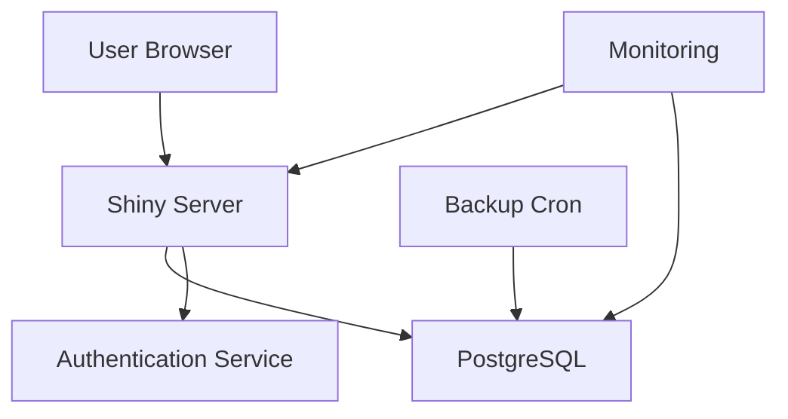

# Production Readiness Implementation Guide

This guide provides step-by-step instructions for implementing all the fixes from the production readiness audit.

## ✅ IMPLEMENTED FIXES (Ready to Use)

The following fixes have been implemented and are ready for deployment:

### Phase 1: Critical Security (Weeks 1-2)

#### ✅ 1. Removed Hardcoded Credentials
- **File**: `docker-compose.yml`
- **Change**: Now uses Docker secrets instead of hardcoded passwords
- **Action Required**: Create `secrets/db_password.txt` with your password
  ```bash
  echo "YOUR_SECURE_PASSWORD" > secrets/db_password.txt
  chmod 600 secrets/db_password.txt
  ```

#### ✅ 2. Docker Secrets Configuration
- **Files Created**:
  - `secrets/db_password.txt.template`
  - `secrets/README.md`
  - Updated `.gitignore` to exclude actual secrets
- **Action Required**: Follow instructions in `secrets/README.md`

#### ✅ 3. SQL Injection Prevention
- **File Created**: `shiny-app/utils/input_validation.R`
- **Changes**: Added validation functions for all user inputs
- **Action Required**: Source this file in `global.R` (add to line 34):
  ```r
  source("utils/input_validation.R")
  ```

#### ✅ 4. Authentication System
- **Files Created**:
  - `shiny-app/config/auth_config.R`
  - `shiny-app/app_with_auth.R`
  - `docs/AUTHENTICATION.md`
- **Action Required**: To enable authentication:
  ```bash
  # 1. Install required packages
  R -e "install.packages(c('shinymanager', 'bcrypt'))"

  # 2. Backup current app.R
  cp shiny-app/app.R shiny-app/app_no_auth.R

  # 3. Use authenticated version
  cp shiny-app/app_with_auth.R shiny-app/app.R

  # 4. Create initial users (see docs/AUTHENTICATION.md)
  ```

#### ✅ 5. Updated Dependencies
- **File**: `DESCRIPTION`
- **Changes**: Updated to latest stable package versions + added security/testing packages
- **Action Required**: Update packages:
  ```r
  remotes::install_deps(dependencies = TRUE)
  ```

### Phase 2: Stability & Reliability (Weeks 3-5)

#### ✅ 6. Session Cleanup Handlers
- **File Created**: `shiny-app/server_improved.R`
- **Changes**: Adds proper resource cleanup, prevents memory leaks
- **Action Required**: Replace current `server.R`:
  ```bash
  cp shiny-app/server.R shiny-app/server_original.R
  cp shiny-app/server_improved.R shiny-app/server.R
  ```

#### ✅ 7. Connection Pool Optimization
- **File**: `shiny-app/config/app_config.R`
- **Changes**: Increased from 5 to 20 connections
- **Action Required**: None (already updated)

#### ✅ 8. Unit Tests
- **Files Created**:
  - `tests/testthat/test-input-validation.R`
  - `tests/testthat/test-data-processing.R`
  - `tests/testthat/test-error-handling.R`
- **Action Required**: Run tests:
  ```r
  testthat::test_dir("tests")
  ```

#### ✅ 9. CI/CD Improvements
- **File**: `.github/workflows/ci-improved.yml`
- **Changes**: Tests now block merges, added security scanning
- **Action Required**: Replace current CI:
  ```bash
  cp .github/workflows/ci.yml .github/workflows/ci_original.yml
  cp .github/workflows/ci-improved.yml .github/workflows/ci.yml
  ```

#### ✅ 10. Database Indexes
- **File**: `db/migrations/04_add_indexes.sql`
- **Action Required**: Run migration:
  ```bash
  psql -U authorship_admin -d american_authorship -f db/migrations/04_add_indexes.sql
  ```

### Phase 3: Deployment & Infrastructure (Weeks 6-8)

#### ✅ 11. Database Backup Script
- **File**: `scripts/backup/backup_database.sh`
- **Action Required**: Setup automated backups:
  ```bash
  # Test backup script
  ./scripts/backup/backup_database.sh

  # Add to cron for daily backups at 2 AM
  crontab -e
  # Add: 0 2 * * * /path/to/anesko/scripts/backup/backup_database.sh
  ```

#### ✅ 12. Monitoring Stack
- **Files Created**:
  - `docker-compose.monitoring.yml`
  - `monitoring/prometheus.yml`
- **Action Required**: Start monitoring:
  ```bash
  # Create Grafana password secret
  echo "YOUR_GRAFANA_PASSWORD" > secrets/grafana_password.txt

  # Start monitoring stack
  docker-compose -f docker-compose.yml -f docker-compose.monitoring.yml up -d

  # Access Grafana: http://localhost:3000 (admin/YOUR_GRAFANA_PASSWORD)
  # Access Prometheus: http://localhost:9090
  ```

### Phase 4: Documentation (Weeks 9-12)

#### ✅ 13. CITATION File
- **File**: `CITATION`
- **Action Required**: Register with Zenodo for DOI:
  1. Go to https://zenodo.org
  2. Link GitHub repository
  3. Create release
  4. Update CITATION file with DOI

---

## ⚠️ FIXES THAT REQUIRE MANUAL ACTION

The following fixes cannot be automated and require manual implementation:

### 🔐 Security Actions

#### 1. Rotate Database Password (CRITICAL - Do Immediately)
The password `anesko2024_secure` was in version control and must be considered compromised.

```bash
# 1. Generate new password
NEW_PASSWORD=$(openssl rand -base64 32)
echo $NEW_PASSWORD

# 2. Update PostgreSQL
psql -U postgres -c "ALTER USER authorship_admin WITH PASSWORD '$NEW_PASSWORD';"

# 3. Update secrets file
echo "$NEW_PASSWORD" > secrets/db_password.txt

# 4. Restart services
docker-compose down
docker-compose up -d
```

#### 2. Audit Git History
Check if credentials were exposed in public repository:

```bash
# Search git history for passwords
git log -p -S "anesko2024_secure"

# If repository was public, consider it compromised
# Force push history cleanup (DANGEROUS - coordinate with team):
git filter-repo --path docker-compose.yml --invert-paths
```

#### 3. Enable Authentication (Recommended)
Follow steps in "Implemented Fixes #4" above.

### 🧪 Testing Actions

#### 4. Load Testing
Cannot be automated - requires running application:

```r
# Install shinyloadtest
install.packages("shinyloadtest")

# Record session
shinyloadtest::record_session("http://localhost:3838")

# Run load test (50 concurrent users)
shinycannon record.log http://localhost:3838 \
  --workers 50 \
  --loaded-duration-minutes 5 \
  --output-dir loadtest_results
```

#### 5. UI Testing with shinytest2
Requires interactive recording:

```r
# Install shinytest2
install.packages("shinytest2")

# Record test
shinytest2::record_test("shiny-app/")

# This opens browser - interact with app to record test
# Tests will be saved to tests/testthat/
```

#### 6. User Acceptance Testing (UAT)
- Recruit test users from research team
- Create UAT checklist (see below)
- Document bugs and issues
- Fix before production deployment

**UAT Checklist**:
- [ ] Dashboard loads without errors
- [ ] All filters work correctly
- [ ] Data exports successfully
- [ ] Visualizations render properly
- [ ] No broken links or images
- [ ] Authentication works (if enabled)
- [ ] Mobile responsiveness acceptable

### 🏗️ Infrastructure Actions

#### 7. Optimize Dockerfile (Multi-Stage Build)
Requires testing to ensure compatibility:

```dockerfile
# Current Dockerfile is functional but not optimized
# For production, create multi-stage build:

FROM rocker/shiny:4.3.0 AS builder
WORKDIR /build
COPY DESCRIPTION .
RUN R -e "remotes::install_deps()"

FROM rocker/shiny:4.3.0
COPY --from=builder /usr/local/lib/R/site-library /usr/local/lib/R/site-library
COPY shiny-app/ /srv/shiny-server/american-authorship/
# ... rest of Dockerfile
```

#### 8. Setup Production Infrastructure
Choose deployment platform and implement:

**Option A: Kubernetes**
1. Create K8s manifests (deployment, service, ingress)
2. Setup TLS certificates
3. Configure autoscaling
4. Deploy to cluster

**Option B: AWS/Cloud**
1. Provision EC2/VM instances
2. Setup load balancer
3. Configure auto-scaling groups
4. Setup RDS for PostgreSQL

**Option C: shinyapps.io**
```r
# Simplest option for small-scale deployment
rsconnect::deployApp("shiny-app/")
```

### 📊 Monitoring Actions

#### 9. Configure Alerting Rules
Edit `monitoring/prometheus.yml` to add alert rules:

```yaml
# Create monitoring/alerts.yml
groups:
  - name: american_authorship_alerts
    rules:
      - alert: HighErrorRate
        expr: rate(errors_total[5m]) > 0.05
        for: 5m
        labels:
          severity: warning
        annotations:
          summary: "High error rate detected"

      - alert: DatabaseDown
        expr: up{job="postgres"} == 0
        for: 1m
        labels:
          severity: critical
        annotations:
          summary: "PostgreSQL database is down"
```

#### 10. Setup Log Aggregation
For production, centralize logs:

```bash
# Option 1: ELK Stack
docker run -d --name elasticsearch elasticsearch:8.10.0
docker run -d --name kibana kibana:8.10.0
docker run -d --name logstash logstash:8.10.0

# Option 2: Cloud service (DataDog, Splunk, etc.)
# Configure according to service provider
```

### 📝 Documentation Actions

#### 11. Create Architecture Diagrams
Use tools like draw.io, Mermaid, or PlantUML:



Save diagrams to `docs/architecture/`

#### 12. Complete Operational Runbook
Expand `docs/RUNBOOK.md` with:
- Deployment procedures
- Rollback procedures
- Incident response playbook
- Escalation contacts
- Common troubleshooting scenarios

---

## 📋 DEPLOYMENT CHECKLIST

Before deploying to production:

### Pre-Deployment
- [ ] All tests passing (`testthat::test_dir("tests")`)
- [ ] Code coverage > 50% (`covr::package_coverage()`)
- [ ] Linting passes (`lintr::lint_package()`)
- [ ] Database password rotated
- [ ] Secrets configured properly (not in git)
- [ ] Authentication enabled (if required)
- [ ] Load testing completed
- [ ] UAT sign-off received

### Deployment Day
- [ ] Database backup created
- [ ] Monitoring stack running
- [ ] Health checks passing
- [ ] SSL/TLS certificates valid
- [ ] DNS configured
- [ ] Rollback plan documented
- [ ] Team notified of deployment

### Post-Deployment
- [ ] Smoke tests passed
- [ ] Monitoring alerts configured
- [ ] Documentation updated
- [ ] Changelog updated
- [ ] Stakeholders notified

---

## 🆘 TROUBLESHOOTING

### Docker Secrets Not Working
```bash
# Ensure secrets file exists
ls -la secrets/db_password.txt

# Check file permissions
chmod 600 secrets/db_password.txt

# Verify docker-compose can read secrets
docker-compose config | grep -A 3 secrets
```

### Tests Failing
```r
# Run tests with verbose output
testthat::test_dir("tests", reporter = "progress")

# Run specific test file
testthat::test_file("tests/testthat/test-input-validation.R")
```

### Monitoring Stack Issues
```bash
# Check container logs
docker-compose -f docker-compose.monitoring.yml logs prometheus
docker-compose -f docker-compose.monitoring.yml logs grafana

# Restart monitoring stack
docker-compose -f docker-compose.monitoring.yml restart
```

### Authentication Not Working
```r
# Check credentials file
credentials <- readRDS("shiny-app/config/users.rds")
print(credentials)

# Verify password hash
bcrypt::checkpw("your_password", credentials$password[1])
```

---

## 📞 SUPPORT

For implementation support:
- Check `docs/RUNBOOK.md` for operational procedures
- Review `docs/AUTHENTICATION.md` for auth setup
- Consult `secrets/README.md` for secrets management
- See audit report for detailed findings and recommendations

---

**Last Updated**: November 13, 2025
**Audit Score**: 48/100 → Target: 80+/100 after implementation
